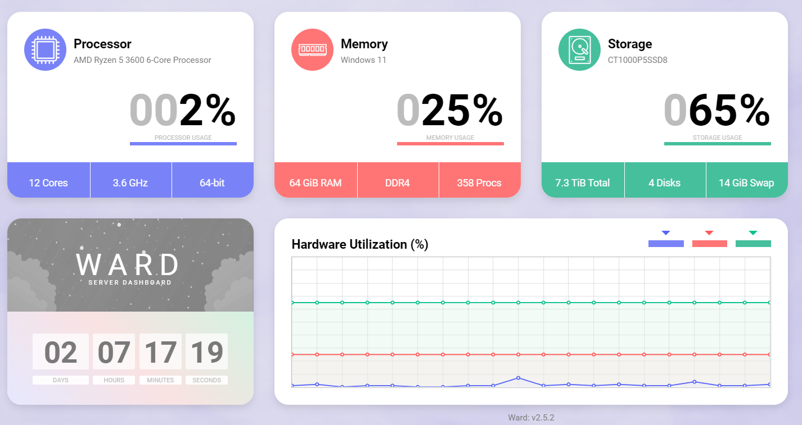

# Ward_CN

## Ward性能监控的中文版本（基于JDK17） 原项目：https://github.com/AntonyLeons/Ward


# Ward 服务器监控工具  

<h3 align="center">  
  
  
</h3>  

<h3 align="center">  
      
</h3>  

---

## [演示](https://status.leons.dev)  

# 快速开始  

## Docker 部署  

* 运行以下命令启动容器：  

```sh
docker run --restart unless-stopped -it -d --name ward -p 4000:4000 -e WARD_PORT=4000 -e WARD_THEME=dark --cap-add SYS_PTRACE antonyleons/ward
```

* 在浏览器中访问 `localhost:4000`  

另外，可参考根目录下的 [docker-compose.yml](https://github.com/AntonyLeons/Ward/blob/main/docker-compose.yml) 示例文件。  

## Java 运行  

从 [这里](https://github.com/AntonyLeons/Ward/releases/latest) 下载最新发布的 `ward.jar`，然后执行：  

```sh
java -jar ward.jar
```  

---

## 关于 Ward  

Ward 是一款简单且极简的服务器监控工具，支持自适应设计，并提供深色主题模式。它仅显示关键信息，非常适合希望使用美观仪表盘而非繁杂数据和图表的用户。  
Ward 兼容所有主流操作系统，因为它使用了 [OSHI](https://github.com/oshi/oshi) 库。  

**已在以下系统测试：** `Windows` `Linux`  

<p align="center">  
      
    <h6 align="center">预览图</h6>  
</p>  

---

## 安装  

### 创建自定义 JAR 包  

1. 克隆项目  
2. 以 Maven 项目导入 IDE  
3. 执行 `mvn clean package`  
4. 请注意，pom.xml可自行修改JDK版本，默认为 JDK17

### 运行 JAR 文件  

1. 按上述步骤创建 JAR 文件  
2. 以管理员权限在 Windows 或 Linux 上运行  
3. 访问 `localhost:4000` 进行应用程序设置  

### 构建 Docker 镜像  

1. 克隆项目  
2. 构建 Docker 镜像：  

   ```sh
   docker build --tag ward .
   ```

3. 运行容器：  

   ```sh
   docker run --restart unless-stopped -it -d --name ward -p 4000:4000 -e WARD_PORT=4000 -e WARD_THEME=dark --cap-add SYS_PTRACE ward
   ```

4. 在浏览器中访问 `localhost:4000`  

---

## 配置  

要更改 Ward 的配置，可以编辑 `setup.ini` 文件。  
使用 Docker 部署时，可以通过环境变量 `WARD_NAME`、`WARD_THEME` 和 `WARD_PORT` 自动生成配置文件，并跳过 GUI 设置。  

| 设置项           | 环境变量         | 描述                                      | 默认值  |  
|-----------------|-----------------|------------------------------------------|--------|  
| serverName      | WARD_NAME       | 界面显示的服务器名称                      | Ward   |  
| port            | WARD_PORT       | 监听端口                                 | 4000   |  
| theme           | WARD_THEME      | 主题模式（`light` 或 `dark`）            | light  |  
| enableFog       | WARD_FOG        | 是否启用背景雾效（`true` 或 `false`）    | true   |  
| backgroundColor | WARD_BACKGROUND | 关闭雾效时的背景颜色（Hex 颜色值）       | default|  

环境变量优先级高于配置文件，会覆盖 `setup.ini`。如果未设置环境变量，则 Ward 启动后会生成 `setup.ini`，或在首次访问网页时引导用户完成设置。  
用户也可以手动创建 `setup.ini` 并放置于相同目录。  

示例 `setup.ini` 配置：  

```ini
[setup]
serverName = my-server
theme = dark
port = 8200
enableFog = true
backgroundColor = #303030
```  

---

## 致谢  

- 原作者: [Rudolf-Barbu](https://github.com/Rudolf-Barbu/Ward)  
- 图标来源：  
  - [控制面板图标 - Freepik (Flaticon)](https://www.flaticon.com/free-icons/control-panel)  
  - [处理器图标 - Those Icons (Flaticon)](https://www.flaticon.com/free-icons/processor)  
  - [内存 (RAM) 图标 - srip (Flaticon)](https://www.flaticon.com/free-icons/ram)  
  - [硬盘图标 - Freepik (Flaticon)](https://www.flaticon.com/free-icons/hard-disk)  
